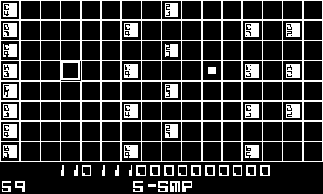
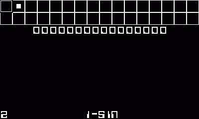
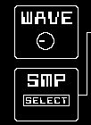

# CS-16 manual

In CS-16, there are three main screens, each of which will be explored in this manual:
1. `pattern`
2. `track`
3. `song`

You can swap between these screens by pressing `B` until the text shown says `screen`, and then cranking. This "crank mode" menu will be accessed often as you use CS-16.

## screens

### pattern

The `pattern` screen is the first you will see when you open CS-16. Here, you can place notes down on each track and edit parameters such as velocity, pitch, and note length.

Here there are five main elements.

| name                  | location        | function                                                            |
| --------------------- | --------------- | ------------------------------------------------------------------- |
| note grid             | top             | shows every note in the current track, and allows you to edit them. |
| active tracks display | below note grid | shows which tracks are playing notes                                |
| step display          | bottom left     | shows which step the sequencer is currently on                      |
| autonote status       | bottom right    | shows if autonote is on, and what interval is selected              |
| track name + number   | bottom          | shows which track is selected                                       |

To place down a note, move your cursor (which should be located at the top left of your note grid) to the space you would like using the d-pad. Afterwards, navigate to the `note status` crank mode option by pressing `B` until that text appears. Then, crank until you see the note turn on or off under your cursor.

To make placing down and editing notes at intervals easier, there is an option in the Playdate menu called `autonote`, which will do this for you.

To edit the pitch of the note, cycle through the crank mode menu until you reach `pitch`, then crank like you did for `note status`. Changing the track, velocity, and note length are done this same way.

You can start or stop the sequence by pressing A.

### track

On the `track` screen, you can edit the instruments of your tracks, mute tracks by pressing `right` in the track list, or mute/unmute all tracks by pressing `left`.

To edit an instrument, select the track you want in the list. It will be marked with the number and the instrument type. Instrument types can be any of the following:

- `SIN` - sine wave
- `SQU` - square wave
- `SAW` - sawtooth wave
- `TRI` - triangle wave
- `NSE` - noise
- `POP` - pocket operator synth phase
- `POD` - pocket operator synth digital
- `POV` - pocket operator synth vosim
- `SMP` - user sample

Once you select a track, you will be inside the instrument editor screen. You can navigate this screen using the d-pad, and interact with elements by either pressing `A` on buttons, or cranking with the mode set to `turn knob` to spin knobs. Each segment is pretty self-explainatory, except for the two modules marked `WAV` and `SMP` located on the left, and the `SHFT` module below `ADSR`.

By turning the `WAV` knob, you can select the waveform that your track uses, but any user imported sample selected in the `SMP` module will be replaced. You will know if a sample is selected by the line connecting the `SMP` segment to `ADSR`.

The `SHFT` module transposes every note in the current track. Its range is -24 to 24 semitones.

When you go to select a sample, you will arrive at a list, usually with four options within it. These options are as follows:

1. `record sample` - here you can record a sample using the microphone. (ui pictured below)

> to change the volume that CS-16 starts recording at, either press `right`/`left` for increments of 1 or `up`/`down` for increments of 5.

2. `samples/` - this is your samples folder, containing all samples imported by the user.
3. `songs/` - all of your saved songs are here.
4. `temp/` - the `temp/` folder contains all of the samples in your song that has not yet been saved. This will be deleted at the end of a session.

Within the file picker, you can enter folders or select a file using `A`, and exit folders or exit the picker using `B`. Like all other lists, you can navigate the list using `up` and `down`. Here you can also preview `.pda` samples by pressing `right`.

If you have already selected a sample, however, there will be an extra option in the list: `edit sample`. In the `edit sample` screen, you can trim your samples. Pressing `left` or `right` changes the selected side, and pressing `up` or `down` changes the interval at which you trim the sample using the crank.

> note: double and triple check your sample before you save it, when you trim it you cannot revert to the original sound.

### song

In the `song` screen, you can view and modify your song's global options, such as the tempo and pattern length. Your song name and author name is displayed at the top.

> IMPORTANT NOTE! currently, the tempo can only be changed by intervals of 7.5 because of a bug in Playdate OS. as soon as a fix is implemented, this message will be deleted. 

Here you can also save and load your songs via the Playdate OS menu. In the menu, you can access and change CS-16 settings, such as dark mode, crank sensitivity, and the name used to sign your saved songs.

## other information

### adding samples

To add your own samples, follow these steps:

1. convert your audio files to signed 16 bit PCM WAV files
	- Using FFMPEG: `ffmpeg -i input_file -c:a pcm_s16le output_file.wav` 
	- Using Audacity: File -> Export as WAV... -> Signed 16 bit PCM
2. compile them using `pdc` into a playdate PDX, which will convert the audio files into PDA files
3. put your playdate into data disk mode
4. drag the PDAs into the `Data/user.*****.com.nano.cs16/samples/` folder on your playdate (feel free to use folders to organize your samples, CS-16 supports them) and eject it when finished.

### sharing/managing/importing songs

To manage your songs:

1. put your playdate into data disk mode
2. navigate to `Data/user.*****.com.nano.cs16/songs/`
3. add, copy, delete, or rename your songs, then eject your playdate when you are done.
