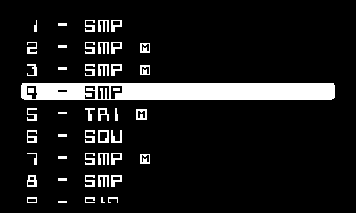
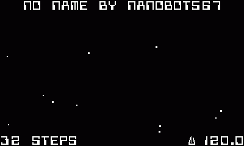

# CS-16 manual

In CS-16, there are four main screens, each of which will be explored in this manual:
1. `pattern`
2. `track`
3. `fx`
4. `song`

You can swap between these screens by pressing `B` until the text shown says `screen`, and then cranking. This "crank mode" menu will be accessed often as you use CS-16.

## screens

### pattern

The `pattern` screen is the first you will see when you open CS-16. Here, you can place notes down on each track and edit parameters such as velocity, pitch, and note length.

Here there are five main elements.

| name                  | location        | function                                                            |
| --------------------- | --------------- | ------------------------------------------------------------------- |
| note grid             | top             | shows every note in the current track, and allows you to edit them. |
| active tracks display | below note grid | shows which tracks are playing notes                                |
| step display          | bottom left     | shows which step the sequencer is currently on                      |
| autonote status       | bottom right    | shows if autonote is on, and what interval is selected              |
| track name + number   | bottom          | shows which track is selected                                       |

To place down a note, move your cursor (which should be located at the top left of your note grid) to the space you would like using the d-pad. Afterwards, navigate to the `note status` crank mode option by pressing `B` until that text appears. Then, crank until you see the note turn on or off under your cursor.

To make placing down and editing notes at intervals easier, there is an option in the Playdate menu called `autonote`, which will do this for you.

To edit the pitch of the note, cycle through the crank mode menu until you reach `pitch`, then crank like you did for `note status`. Changing the track, velocity, note length, and swing are done this same way.

You can start or stop the sequence by pressing A.

### recording

If you would like to input notes in real time, there is a `record` function in CS-16. You can toggle recording via the `record` menu option while on the `pattern` screen.

While in record mode, the `A`, `B`, `up`, `down`, `left`, and `right` buttons are mapped to tracks in the song. When pressed, a note is placed at that step in the corresponding track. If quantization is enabled (not 1), then each note you place will be quantized to the nearest multiple of the quantization value.

> swing is applied when you press `stop record`.

### track

On the `track` screen, you can edit the instruments of your tracks, mute tracks by pressing `right` in the track list, or mute/unmute all tracks by pressing `left`. 

#### copying and pasting track data

In the system menu, there are two options, `copy` and `cpy mode`. To copy a track, move to the track you would like to copy, then enter the system menu and select `copy`. Move to the track you'd like to copy to, then press `paste`. The `cpy mode` option controls what is pasted to the track, which can be either everything (`all`), just the instrument (`inst`), or just the pattern (`ptn`).

#### renaming tracks

To rename one of your tracks, hover over the track you would like to rename, enter the system menu and select `rename`.

To remove your custom track name, enter the `rename` keyboard, delete all of the characters, and press `OK`.

> note: there is a 10-character limit.

#### instrument editor

To edit an instrument, select the track you want in the list. It will be marked with the number and the instrument type. Instrument types can be any of the following:

- `SIN` - sine wave
- `SQU` - square wave
- `SAW` - sawtooth wave
- `TRI` - triangle wave
- `NSE` - noise
- `POP` - pocket operator synth phase
- `POD` - pocket operator synth digital
- `POV` - pocket operator synth vosim
- `SMP` - user sample

Once you select a track, you will be inside the instrument editor screen. You can navigate this screen using the d-pad, and interact with elements by either pressing `A` on buttons, or cranking with the mode set to `turn knob` to spin knobs. Each segment is pretty self-explainatory, except for the two modules marked `WAV` and `SMP` located on the left, and the `SHFT` module below `ADSR`.

By turning the `WAV` knob, you can select the waveform that your track uses, but any user imported sample selected in the `SMP` module will be replaced. You will know if a sample is selected by the line connecting the `SMP` segment to `ADSR`.

The `SHFT` module transposes every note in the current track. Its range is -24 to 24 semitones.

#### sampling

When you go to select a sample, you will arrive at a list, usually with four options within it. These options are as follows:

1. `record sample` - here you can record a sample using the microphone. (ui pictured below)

> to change the volume that CS-16 starts recording at, either press `right`/`left` for increments of 1 or `up`/`down` for increments of 5.

2. `samples/` - this is your samples folder, containing all samples imported by the user.
3. `songs/` - all of your saved songs are here.
4. `temp/` - the `temp/` folder contains all of the samples in your song that has not yet been saved. This will be deleted at the end of a session.

Within the file picker, you can enter folders or select a file using `A`, and exit folders or exit the picker using `B`. Like all other lists, you can navigate the list using `up` and `down`. Here you can also preview `.pda` samples by pressing `right`.

If you have already selected a sample, however, there will be an extra option in the list: `edit sample`. In the `edit sample` screen, you can trim your samples. Pressing `left` or `right` changes the selected side, and pressing `up` or `down` changes the interval at which you trim the sample using the crank.

If you are editing a sample that was recorded with the Playdate's microphone and you have enabled `settings / sampling / save waveforms`, you will see a waveform above the start and end frame locations.

> note: double and triple check your sample before you save it! when you trim it you cannot revert to the original sound.

### fx

In the `fx` screen, you can apply punch-in effects to your pattern. Currently there are four effects (ordered clockwise, starting from the top):

1. `TAPE`: high-pass and low-pass filters
2. `BTC`: bitcrush
3. `WTR`: low-pass filter
4. `OVD`: overdrive

While in this screen, press A to activate or deactivate punch-in. The word `ACTV!` will appear at the center of the screen when it's activated. Once activated, the d-pad buttons enable the corresponding effect when pressed, and disable when not.

It is possible to "lock" your button presses! Enable the effects you would like to lock, then switch the crank mode to `lock effect`. Crank clockwise until you see a "lock" icon appear in the bottom left of your screen. To unlock effects, either crank counter-clockwise to unlock all of them, or press the corresponding d-pad button when punch-in is active.

If you would like to change an effect intensity (signified by the decimal number next to the effect), first ensure that punch-in is deactivated. Then, change the crank mode to `effect intensity` and press the d-pad button according to the effect you would like to modify. You'll know you're good to go when there's a box around the effect text. Now just crank until you reach your desired value! Intensities range from 0 (off) to 1 (full effect).

> note: this can be done while an effect is applied, allowing for some pretty fun live performance stuff!

### song

In the `song` screen, you can view and modify your song's global options, such as the tempo and pattern length (these can be modified via the crank). Your song name and author name is displayed at the top.

Here you can also save and load your songs via the Playdate OS menu. If you select `load`, you can also perform file operations on your songs, such as renaming, deleting, and cloning. You can press `right` to view file metadata as well.

In the system menu, you can also access and change CS-16 settings, such as dark mode, crank sensitivity, and the name used to sign your saved songs. A full list of settings is below.

- `general/`
	- `author` (text value, default anonymous)
	- `output` (audio output. can be auto, speaker, headset, or speaker and headset)
	- `crank speed` (crank sensitivity)
    - `folders > files` (folders should precede files in the file explorer)
	- `credits`
- `behavior/`
	- `play on load` (play pattern immediately on song load)
	- `stop if sampling` (stop the pattern if you are currently sampling audio)
    - `precise tempo chg` (enables precise tempo editing [increment / decrement tempo by 0.1 instead of 1 when editing])
	- `tempo edit stop` (stop the pattern when tempo is modified)
	- `crank docked screen` (which screen appears when the crank is docked. `none` disables changing the screen)
- `recording/` (as in tapping in a pattern)
	- (button) `button track` (when record is active, this button will correspond to this track)
	- `quantization` (quantize recording, can be either off [1], every 16th note [2], or every 8th note [4])
- `sampling/`
	- `sample format` (16 bit or 8 bit)
	- `save waveforms` (save waveform images along with audio)
	- `save .wav samples` (alongside .pda audio, save .wav files when sampling)
- `ui/`
	- `dark mode`
	- `visualizer` (song screen visualizer options)
		- `sine wave` (sine wave where tempo is proportional to frequency and pattern length is proportional to amplitude)
		- `notes` (displays track active statuses)
		- `stars` (purely decorational, but looks pretty awesome lol)
		- `--- external ---` (below this are custom visualizers)
	- `show number / total` (display current crank mode number out of total)
	- `show note names` (display note names in pattern [C#4, F3, etc.])
	- `animate scrn move` (animate screen transitions)
	- `use system font` (use an alternate font)
	- `show log screens` (display log screens, causes some moderate slowdown at the cost of coolness)
	- `fx screen vfx` (when an effect is active, apply the corresponding screen visual effect as well)
	- `50fps` (50fps refresh rate)

## other information

### adding samples

To add your own samples, follow these steps:

1. convert your audio files to signed 16 bit PCM WAV files
	- Using FFMPEG: `ffmpeg -i input_file -c:a pcm_s16le output_file.wav`
        - to reduce file size, you can also add these flags: `-ac 1` (converts to mono) `-b:a 128k` (makes bitrate 128kbps [reduces audio quality slightly, you can go lower if you want])
	- Using Audacity: File -> Export as WAV... -> Signed 16 bit PCM

2. Now you can either...
    - use [this converter](https://ejb.github.io/wav-pda-converter/) to convert the .wav to .pda
    - compile them using `pdc` from the [Playdate SDK](https://play.date/dev/) into a playdate PDX, which will convert the audio files into PDA files (i have provided a pre-made folder for this in `/assets/`. Simply place your .WAVs into that folder, run `pdc convert`, and grab your .PDAs from convert.pdx.)
  
3. put your playdate into [data disk mode](https://help.play.date/games/backups/)
4. drag the PDAs into the `Data/user.*****.com.nano.cs16/samples/` folder on your playdate (feel free to use folders to organize your samples, CS-16 supports them) and eject it when finished.

### sharing/managing/importing songs

To manage your songs:

1. put your playdate into [data disk mode](https://help.play.date/games/backups/)
2. navigate to `Data/user.*****.com.nano.cs16/songs/`
3. add, copy, delete, or rename your songs, then eject your playdate when you are done.

> if you are sharing your songs on the internet, you can set your author name in `settings / general`!!

### ways to improve performance

All of these are things you can do to improve CS-16's performance and reduce frame drops.

- In `settings / ui /`...
    - Disable all `visualizer` elements.
    - Disable `show note names`.
    - Disable `animate scrn move`.
    - Disable `fx screen vfx`.
    - Enable `50fps`.
- Use lower quality samples (ex. lower bitrate)

### custom visualizers

I have a few custom visualizers in this repository under `visualizers` (and maybe you'll find another one on the internet somewhere??? idk haha). To import these into CS-16, check out the visualizer `building / importing` section in the [DEV document](DEV.md).

> note: by default, imported visualizers are disabled. head to `settings / ui / visualizers` to enable them.
