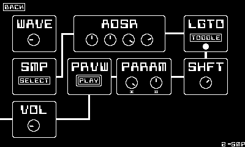

# cs-16 (cranky synth 16)
a synthesizer for playdate

</img>

## [manual](https://github.com/nanobot567/cs-16/blob/main/MANUAL.md) | [license](https://github.com/nanobot567/cs-16/blob/main/LICENSE)

## features
- 16 tracks
- up to 128 sequencer steps
- sampler
- on-device sample editor
- song saving/loading (with author name and timestamp included in the save)
- very customizable

## screenshots

s/track.png "pattern view")

*track view*

*track edit view*

*song view*

### please feel free to submit PRs, report bugs, and request new features!
