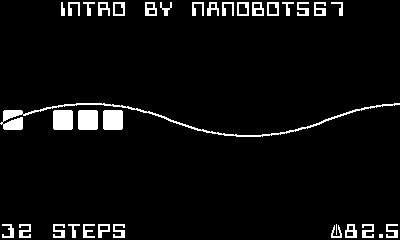

# cs-16 (cranky synth 16)
a synthesizer for playdate

## [manual](https://github.com/nanobot567/cs-16/blob/main/MANUAL.md)

</img>

## features
- 16 tracks
- up to 128 sequencer steps
- sampler
- on-device sample editor
- song saving/loading
- very customizable

## screenshots

*pattern view*

*track view*

*track edit view*

*song view*
